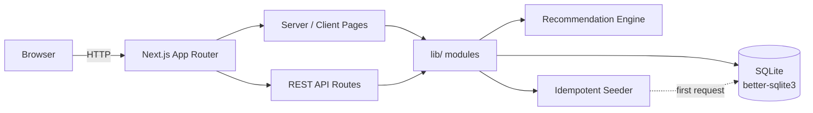
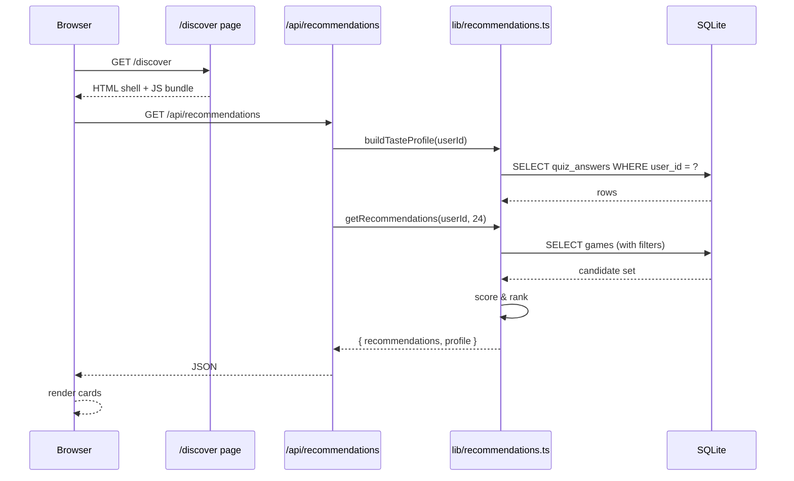

# Architecture Overview

GameScout is one Next.js application with no external services. Pages are server-rendered (or client-rendered with sibling `layout.tsx` files for metadata), API routes handle every mutation, and SQLite holds all state.

## The big picture

Everything in the diagram is in-process. There is no message broker, no separate worker, no external recommendation service.

## The layers

| Layer | Lives in | Job |
| --- | --- | --- |
| **Pages** | `src/app/[page]/page.tsx` | Render the UI. Most are client components; their sibling `layout.tsx` carries page metadata. |
| **API routes** | `src/app/api/**/route.ts` | All mutations and queries that the browser issues. JSON in, JSON out. |
| **Library code** | `src/lib/` | Server-only utilities: DB access, session, recommendations, moods, sanitization, seeding. |
| **Types** | `src/types/index.ts` | Single source of truth for shared interfaces. |
| **Data** | `src/data/` | Static seed catalog (games) and curated personas/deals. |
| **Components** | `src/components/` | Reusable UI: `GameCard`, `Navbar`, `EmptyState`, etc. |

## How a request flows

Take the recommendations page as a concrete example:

The same pattern repeats everywhere: a page hits a route, the route delegates to a `lib/` module, and the module talks to SQLite through the `getDb()` singleton.

## Key invariants

- **One database connection.** `getDb()` returns a singleton initialized lazily. All schema creation lives in the same module.
- **Explicit column lists.** Queries use `GAME_COLUMNS` / `GAME_LIST_COLUMNS` instead of `SELECT *` so adding a column never silently breaks an API.
- **Sanitize before insert.** Every user-supplied string goes through `src/lib/sanitize.ts` before reaching SQL.
- **Sessions are opaque tokens.** No login screen — `getUserId()` mints or reads a signed cookie. See [Sessions & Users](./sessions-and-users).
- **Seed is idempotent and transactional.** Re-running the seeder produces the same state. See [Seed Data](./seed-data).

## Where to go next

- [Taste Profile](./taste-profile) — how raw quiz answers become a weighted profile
- [Recommendation Engine](./recommendation-engine) — the scoring formula
- [Database Schema](../reference/database-schema) — the full table layout
